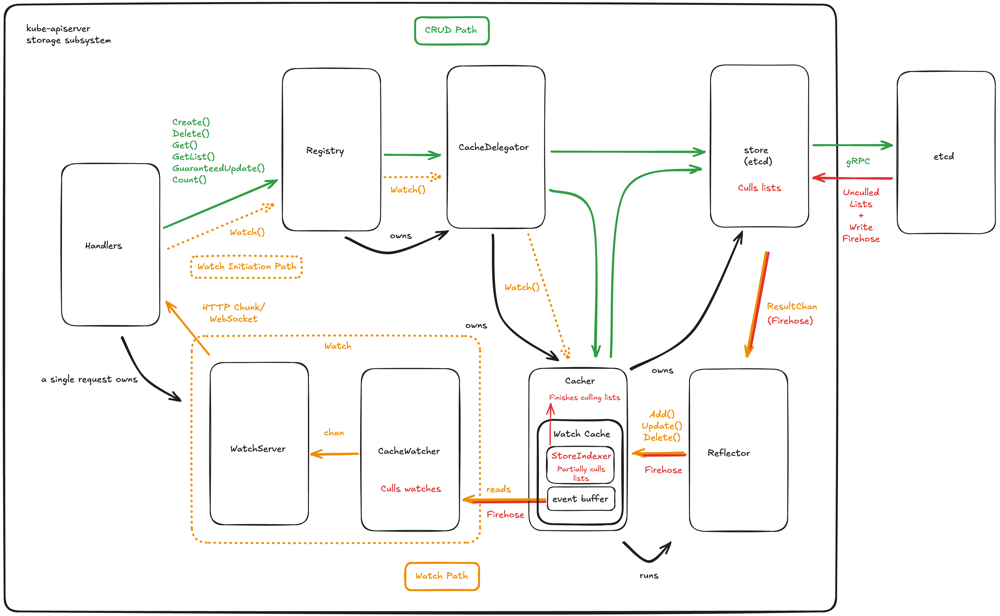

What's the point of the Cacher?
- Etcd is a key-value store, so everything is addressed by its ID and you can't query it for for e.g. Pods by Node, so you have to maintain an in-memory cache with the indexes you want to query them by

Fundamental scaling problems with the design:
- You have to cull lists in the APIServer, so lists that don't hit the cache need to load and deserialize all the values in the key range (empirically very costly)
- You have to consume and deserialize the write firehose in order to maintain your watch cache, and then actually maintain your indexes for every change (empirically surprisingly cheap, but probably breaks as you get to big write volumes or cache sizes)

Implementation-specific bottlenecks:
- Deserialize -> Cull -> Serialize wastes a lot of CPU (empirically very costly)
- Lots of defensive copies to deal with lack of good control over mutability in Go (empirically very costly)
- Together, these create a ton of allocations and GC pressure

Remedies:
- Improve: Remove defensive copies with CoW types, stream through serialized values from the database when possible, try and cull without deserializing using protowire.
- Replace: Be able to treat list predicates as database queries, so your API server only gets what its clients ask for. Eliminate Cacher and Watch Cache entirely, and simply hit the database directly. Possibly do some watch coalescing, but otherwise keep as simple as possible.

Notes:
- FoundationDB Record Layer provides native support for using protocol buffers to define schemas for data types, and doing secondary indexes over them. Seems incredibly promising, especially since kubernetes doesn't do cross-key transactions. 
